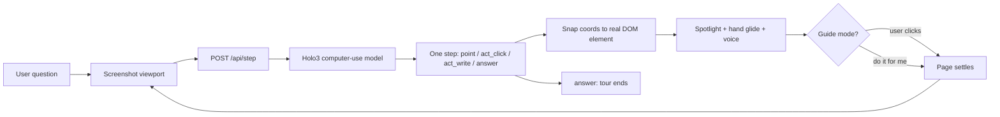

# Handyman (2nd Place @ NVIDA x Accel x HComputer x Gradium x AWS Computer Use Agent Hack)

<p align="center">
  
</p>

**Every website should teach itself.** A guided tour for any site, with zero authored steps.

Software changes constantly and the help never keeps up. Docs, screenshots, and scripted product tours are written once, about a version that no longer exists, and they cannot see the page you are on. Handyman looks at the same screen you do: it screenshots the live page, asks a computer-use model to plan and ground the next action, then points an animated hand at the real element and narrates it aloud. Guidance is generated from the interface as it renders right now, so it cannot go stale, and it works on sites nobody wrote a tour for.

Built for the **Computer Use Agents Hackathon 2026**.

## What Handyman does

1. **Take a question** in plain language, typed or spoken aloud (`Alt+H`).
2. **Look at the page**, screenshotting the viewport exactly as the user sees it.
3. **Plan one step.** A computer-use model returns a single structured action: `point`, `act_click`, `act_write`, or `answer`.
4. **Ground it in the real DOM.** Normalized `[0,1000]` coordinates snap to an actual element, cross-checked against the model's own description of it, so a few pixels of drift cannot highlight the neighbouring link.
5. **Show the user.** An animated hand glides to the element and points, a voice reads the instruction, and the page underneath stays fully live.
6. **Wait for the human.** Their own real click on the real element advances the tour. "Do it for me" hands the wheel over instead.
7. **Re-plan and repeat** from a fresh screenshot, across page loads, until the answer arrives.

## Why it is different

Product tours today are authored: a human writes each step, pins it to a CSS selector, and the tour breaks the moment the UI moves. Handyman has no authored steps, so nothing goes stale and nothing needs maintaining. Every step is re-derived from the page as it currently renders, which is why it follows redirects, modals, A/B variants, and layouts it has never seen.

The user stays in control. Guide mode is the default: the widget points, the human clicks, and that click is what moves the tour forward. Autopilot is strictly opt-in. The model cannot promote itself into acting, and it never overwrites text the user typed themselves.

## Sponsor technology

- **H Company.** `holo3-1-35b-a3b` does the perception and grounding: one screenshot in, one structured tool call out, per turn. The [Agents Platform](https://hub.hcompany.ai/computer-use-agents/multi-agent) powers the site scout, where a manager agent fans out parallel subagents, each driving its own cloud browser.
- **Gradium.** Voice in both directions. TTS narrates each step aloud, STT lets the user ask by speaking. Both run over WebSocket, authenticated with ephemeral single-use tokens minted server-side, so the API key never leaves the server.

## Architecture



The server is a thin key-holding proxy with no database. The widget ships as a single IIFE mounted in Shadow DOM, so host-page CSS cannot deform it and its own styles never leak out.

## Running on sites you do not own

Real websites break a naive in-page widget in three ways. The Chrome extension routes around each, because its service worker is the one context a page's CSP cannot reach.

| Problem | Symptom | How Handyman gets through |
|---|---|---|
| CSP `img-src` | Screenshot fails, so the tour dies before the model is called | `chrome.tabs.captureVisibleTab` in the service worker, so the page never loads or decodes an image |
| CSP `connect-src` | Proxy calls and the voice WebSocket are killed | Both relayed through the background worker, which owns the real socket |
| Event retargeting | The page treats the widget's keystrokes as its own, and a click on the tour card dismisses the page's open menus | Widget keys and clicks are contained at the shadow boundary, so the page's handlers never see them |

## Quick start

Requires [Bun](https://bun.sh), Chrome, and an H Company API key ([portal.hcompany.ai](https://portal.hcompany.ai)). A [Gradium](https://gradium.ai) key is optional and enables voice.

```bash
bun install
cp server/.env.example server/.env    # add HAI_API_KEY, and GRADIUM_API_KEY for voice
bun run demo                          # builds widget + extension, serves the proxy on :3000
```

Then load the extension:

1. Open `chrome://extensions` and enable **Developer mode**.
2. **Load unpacked**, and select `apps/extension/dist`.
3. Open any website, click the launcher at bottom-right or press `Alt+H`, and ask a question.

The extension popup toggles Handyman per site and sets the proxy endpoint, TTS, and STT.

On a site you own, you can skip the extension and embed the widget directly. It then screenshots in-page and opens the voice socket from the page, which a strict-CSP site will block.

```html
<script src="/handyman.js"></script>
<script>
  Handyman.init({ endpoint: "/api" });
</script>
```

## Configuration

Credentials belong in `server/.env`. Never commit API keys.

| Variable | Required | Purpose |
|---|---:|---|
| `HAI_API_KEY` | Yes | H Company Models API. `/api/step` returns 503 without it |
| `GRADIUM_API_KEY` | For voice | Gradium TTS/STT. Without it, `/api/voice-token` returns 503 and tours run silently |
| `PORT` | No | Server port, defaults to `3000` |

Widget options, passed to `Handyman.init(config)`:

| Option | Default | Purpose |
|---|---|---|
| `endpoint` | required | Proxy base, for example `http://localhost:3000/api` |
| `tts` | `true` | Voice narration of each step |
| `stt` | `true` | Ask by voice |
| `hotkey` | `"Alt+KeyH"` | Toggles listening. Matched on physical key, so it is layout independent |
| `zIndex` | `2147483000` | Base z-index for the widget's layers |

## Commands

| Command | Description |
|---|---|
| `bun run demo` | Build widget and extension, then serve the proxy on `:3000` |
| `bun run server` | Serve the proxy only |
| `bun run build` | Build the widget IIFE into `packages/core/dist` |
| `bun run build:ext` | Build the extension into `apps/extension/dist` |
| `bun test` | Run the widget test suite |
| `bun run typecheck` | Run `tsc` over widget and server |

## Project layout

| Path | What |
|---|---|
| `packages/core` | The widget: agent-loop session, overlay engine, hand pointer, element snapping, voice clients |
| `server` | Key-holding proxy: `/api/step` (Holo3), `/api/voice-token` (Gradium) |
| `server/scout` | Multi-agent site scout (hai-agents SDK) |
| `apps/extension` | Chrome extension: runs the widget anywhere, bridges capture, network, and voice past page CSP |
| `apps/video` | Remotion launch film (~88 s, 8 scenes, real demo footage) — see its README |
| `assets` | Brand assets: the hand as SVG and transparent/white PNGs |

## Built with

H Company Holo3 and the Agents Platform (hai-agents SDK), Gradium TTS/STT, Bun, Hono, TypeScript, and Chrome MV3. The widget's only runtime dependency is [snapdom](https://github.com/zumerlab/snapdom), used for in-page rasterization on the embed path.

Figtree is used under the SIL Open Font License.

## License

MIT. See [LICENSE](LICENSE).
